# Scrum

/************************************ 
*              Intro 				*
************************************/

!SLIDE
# SCRUM
## by Sebastian Pereyro
### Ruby Cordoba - Nov, 2012

!SLIDE
# If I'm not having fun   I'm not doing it right

!SLIDE
#Idea
## Talk about Scrum using Scrum...

!SLIDE
## ...and a tool.

!SLIDE
# The Plan
## 1 Sprint
## 5 Features
## Digital Board

!SLIDE
# The Features
* Feature 1: Why Scrum? (10 min)
* Feature 2: The Basics (10 min)
* Feature 3: Plan Releases & Sprints (10 min)
* Feature 4: Sprint Execution (10 min)
* Feature 5: Final Thoughts (10 min)

!SLIDE
# Feature 1 
## Why Scrum?
##### [update board](https://trello.com/board/scrum-presentation/50af338f152515fb25000293)

!SLIDE
# Agile Manifesto
## 4 Values
## [12 Principles (link)](http://agilemanifesto.org/principles.html)

!SLIDE
## 4 Values
 
* **Individuals and interactions** over processes and tools
* **Completed functionality** over comprehensive documentation
* **Customer collaboration** over contract negotiation
* **Responding to change** over following a plan
 
##### While there is value in the items on the right, the items on the left matter more.

!SLIDE
### 1993 - Jeff Sutherland implemented it.
### 1995 - Ken Schawber formalized it.

!SLIDE
## Say Hi!
 

!SLIDE left
# Scrum Definition
### A **development framework** based on **empirical process control** wherein **cross functional, self organizing teams** deliver **working software every thirty days (or less)**.

!SLIDE
# Process Control Approaches
## Empirical vs Defined

!SLIDE
# Empirical Process
* ### Exercises control through frequent inspection and adaptation for processes that
* ### Are imperfectly defined and generate unpredictable and unrepeatable outputs.

!SLIDE
# Defined Process in Software Development
* ### For many years, SW Dev methodologies have been based on the defined process control model.
* ### But SW Dev, isn’t a process that generates the same output every time given a certain input. 

!SLIDE
#...another definition...

!SLIDE
#SCRUM is a cool set of tricks

!SLIDE
# Evolving Process

!SLIDE

!SLIDE
## SHU
### Hold, Abide, Defend 
#### (Learn by the book)

!SLIDE
## HA
### Break 
#### (Try new stuff, improve)

!SLIDE
## RI
### Leave, Depart, Fly
#### (Trascend, become part of it, see the matrix, become NEO)

!SLIDE
# Feature 2
## The Basics
##### [update board](https://trello.com/board/scrum-presentation/50af338f152515fb25000293)

!SLIDE
# Framework
### 1 Product Vision
### 3 Roles
### 4 Meetings
### 3 Artifacts

!SLIDE scrum-overview
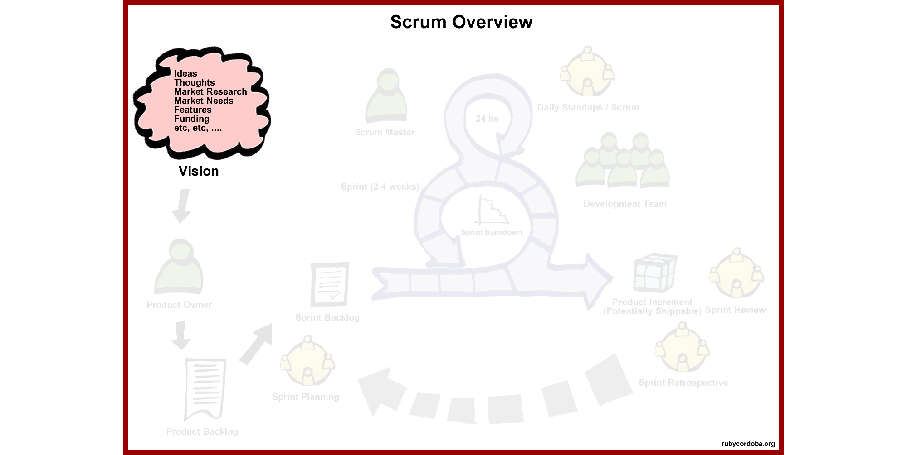

!SLIDE scrum-overview
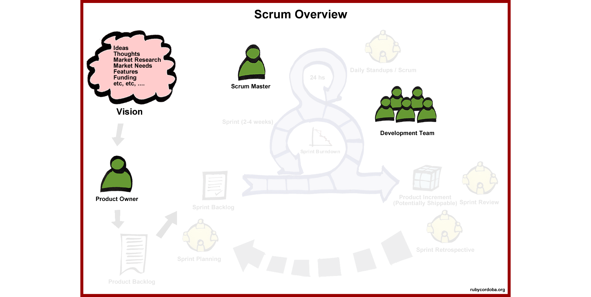

!SLIDE scrum-overview
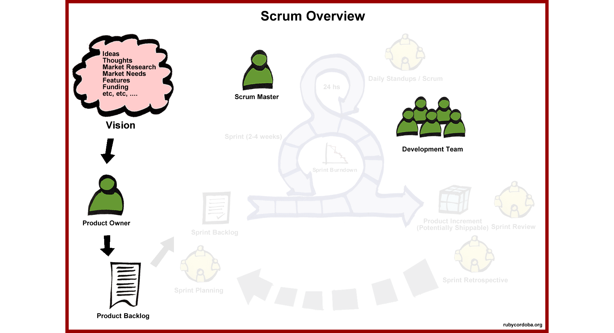

!SLIDE scrum-overview
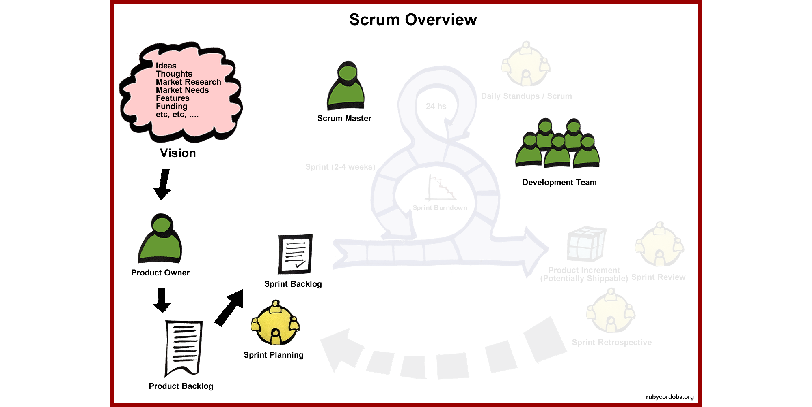

!SLIDE scrum-overview
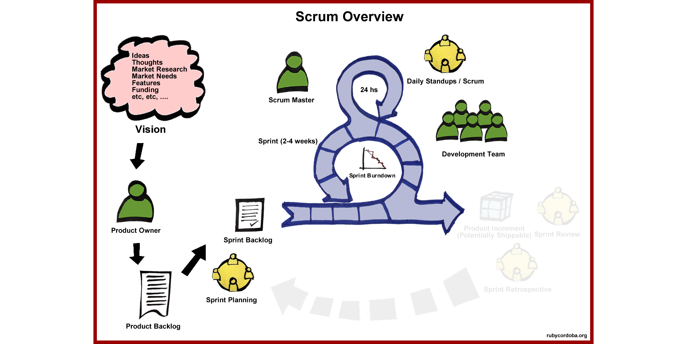

!SLIDE scrum-overview
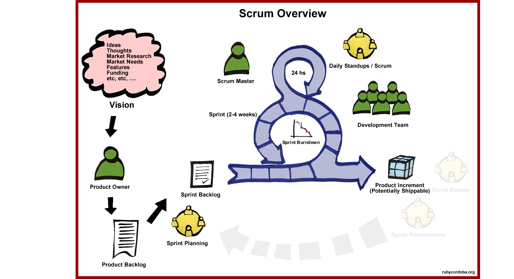

!SLIDE scrum-overview
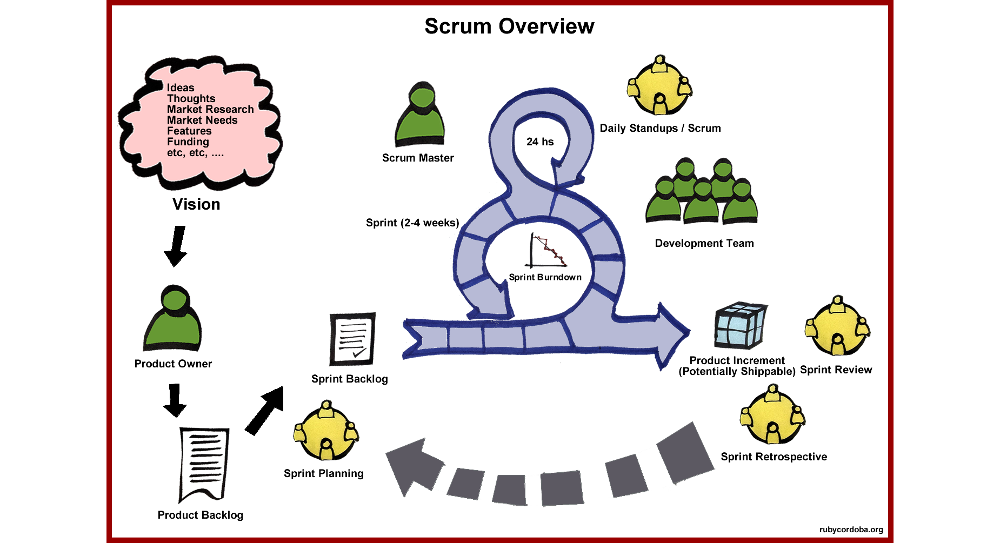

!SLIDE left
# Product Backlog (Rules)
* List of everything we want the team to work on
* Includes user facing features, architectural work, defects, etc.
* Cannot have multiple Product Backlogs for the same team 
* Can have multiple teams pull from same Product Backlog 
* Prioritized (or ordered) from 1-n
* Priority is owned by the Product Owner
* Flexible: items can be added/removed/edited at any time
* Only items in the current sprint are locked down

!SLIDE left
# Product Backlog (In Practice)
* Items at the top of the backlog have been refined and are at a higher level of detail than lower priority items
* Multiple stakeholders contribute items, including team members
* User-facing items are written as valuable User Stories
* Product Backlog Items are estimated by the team. Current agile practice: Many teams use “Story Points” or some similar method to provide a relative size estimate, vs. a time estimate

!SLIDE left
# Product Backlog (More to Consider)
* Product Backlog is regularly updated and refined. Current agile practice: Many Product Owners meet weekly with the team to refine the backlog
* Refinement includes activities like decomposing large items into smaller ones using a “vertical slice” approach, estimating items, and getting consensus on acceptance criteria
* Supplemented by other artifacts that help provide context (like Product Vision, Road Map, Story Map)

!SLIDE
# Feature 3
## Plan Releases & Sprints
##### [update board](https://trello.com/board/scrum-presentation/50af338f152515fb25000293)

!SLIDE
#Estimation Accuracy
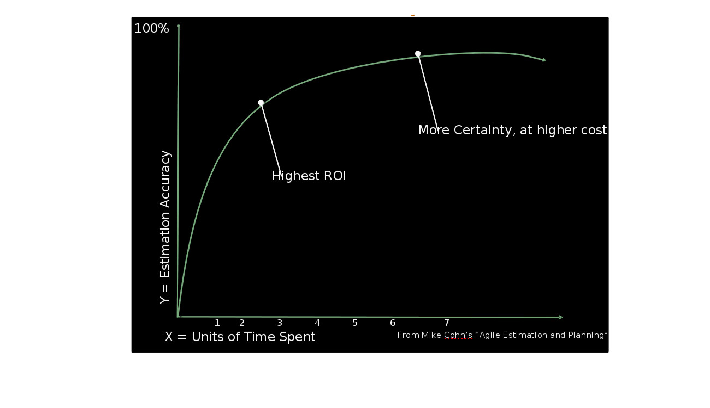

!SLIDE left
# 2 Level of Planning
## Release Planning
### Enable product level decisions such as scope, release date, resources required
## Sprint Planning
### Enable the scrum team to commit to a specific set of work for a given sprint

!SLIDE
# We are better at estimating size, not time. 
## Good at none :P

!SLIDE
# Agile Estimation Rule
## Estimate size, derive time

!SLIDE
# Estimation Techniques
* ## Affinity
* ## Poker

!SLIDE
#Affinity
## Smaller items to the left, bigger to the right in relation to each other

!SLIDE
#Affinity values
## xs, s, m, l, xl
## 0,1,2,3,5,8,13,20,40,100,?,fernet

!SLIDE
#Affinity in practice
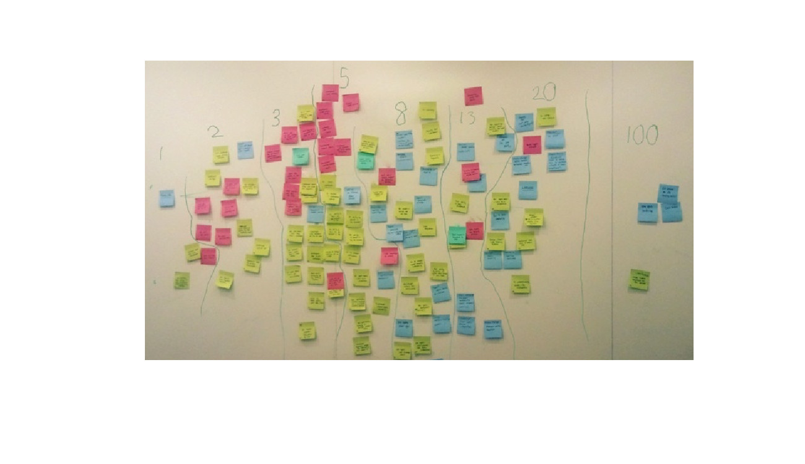

!SLIDE left
# Poker Planning
* Iterative, team based approach
* Each estimator has a deck of cards with potential estimates based on a set.
* Product Owner reads a backlog item, brief clarifying discussion occurs
* Estimators choose a card indicating their estimate
* Cards are revealed all at once. Differences are discussed, especially outliers
* Re-vote until estimates converge

!SLIDE
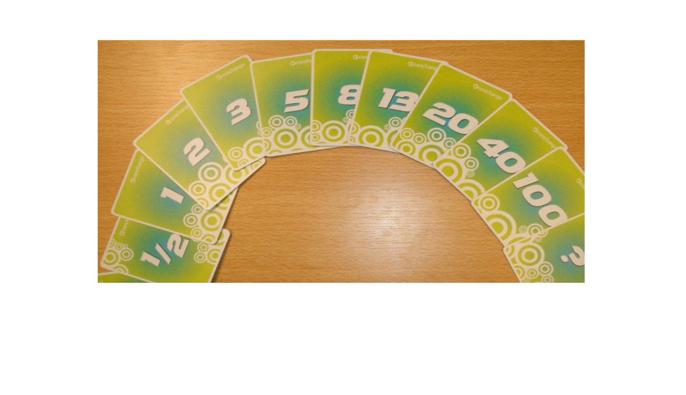

!SLIDE left
#Sprint Planning
* **Timebox:** 2 hours per week of sprint
* Arrive at a commitment to a sprint goal or set of Product Backlog Items (PBIs) to be completed
* Facilitated by Scrum Master
* Product Owner provides details on PBIs and Priority
* Team creates a plan to deliver as much value as possible while meeting the Definition of Done

!SLIDE
#Definition of Done
## I am done when...

!SLIDE left
#Definition of Done
* The quality bar each Product Backlog Item must pass
* Whatever the team agrees that EVERY Product Backlog Item must go through to be considered done, potentially releasable software. 
* A good definition of done should:
- ** Be attainable without assistance from outside of the team ** 
- ** Not include items such as “QE signed off”**

!SLIDE left
# Definition of Done (Sample)
* Every check-in has formal code review and feedback integrated
* If story marked as “risky”, used pair programming
* Unit Tests all passing
* Code checked into main
* Tested using pseudo -translation build
* No open bugs for user story. (Bugs are fixed or closed).
* All acceptance tests passing.

!SLIDE
# Feature 4
## Sprint execution
##### [update board](https://trello.com/board/scrum-presentation/50af338f152515fb25000293)

!SLIDE left
# The Sprint: Rules
* Product Owner can’t add new items to the sprint once Sprint Planning is complete
* Product Owner can Abnormally Terminate a sprint in the case of an urgent issue. This should be rare for most products.
Zero Day security problem/bug
Major, urgent revenue opportunity
Major market shift
* Team can’t extend the length of the sprint in order to finish items

!SLIDE left
# Sprint Burndown Chart
* Simple tool used by the Team to provide 
* a measurement on how close they are to meeting the Sprint Goal 
* by the end of the Sprint

!SLIDE
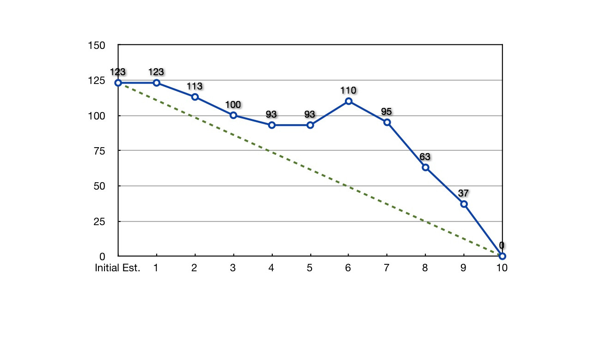

!SLIDE
# Daily Scrums
## Coordination, synchronization for team

!SLIDE left
# Three Questions
* What have you done?
* What will you do?
* What’s slowing you down? (impediments)

!SLIDE left
# Sprint Review
* **Timebox:** 1 Hour per week of sprint
* Inspect and Adapt the Product
* Collaborative discussion of what was built
* Informal
* No slides
* Minimal prep
* Whole team participates
* Invite the world

!SLIDE left
# Sprint Retrospective
* **Timebox:** 1 Hour per week of sprint
* “Inspect” process
* Regular opportunity to improve the system
* Done after every sprint
* Whole team participates
* Choose one specific change to make for next sprint

!SLIDE
# Feature 5
## Share Some Thoughts
##### [update board](https://trello.com/board/scrum-presentation/50af338f152515fb25000293)

!SLIDE left
* ### Easy to learn, hard to master (like ruby?)
* ### Team Collaboration
* ### Inspect & Adapt
* ### Self managed
* ### Proactive approach
* ### Scrum + XP (Continuous integration, pair programming, TDD, Refactoring, etc)

!SLIDE
# Thanks

!SLIDE
# Links
* ### [Scrum Alliance](http://scrumalliance.org)
* ### [Agile Atlas](http://agileatlas.org/)
* ### [The Scrum Guide](http://www.scrum.org/Portals/0/Documents/Scrum%20Guides/Scrum_Guide.pdf)
* ### [Trello App](https://trello.com/board/scrum-presentation/50af338f152515fb25000293)